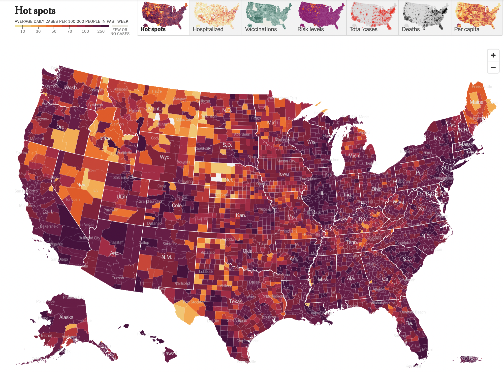

  
  In May 2020, the Georgia Department of Public Health posted the following plot to illustrate the number of confirmed COVID-19 cases in their hardest-hit counties over a two-week period. Health officials claimed that the plot provided evidence that COVID-19 cases were decreasing and made the argument for reopening the state.

{ width=75% }

The plot was heavily criticized by the statistical community and several media outlets for its deceptive portrayal of COVID-19 trends in Georgia. Whether the end result was due to malicious intent or simply poor judgment, it is incredibly irresponsible to publish data visualizations that obscure and distort the truth. 

Data visualization is an incredibly powerful tool that can affect health policy decisions. Ensuring they are easy to interpret, and more importantly, showcase accurate insights from data is paramount for scientific transparency and the health of individuals. For this assignment you are tasked with reproducing COVID-19 visualizations and tables published by the [New York Times](https://www.nytimes.com/interactive/2020/us/coronavirus-us-cases.html).
Specifically, you will attempt to reproduce the following for January 12th, 2022:
  
  1. New cases as a function of time with a rolling average plot - the first plot on the page (you don't need to recreate the colors or theme)
2. Table of cases, hospitalizations and deaths - the first table on the page
3. The county-level map for previous week ('Hot spots') - the second plot on the page (only the 'Hot Spots' plot)
4. Table of cases by state - the second table on the page (do not need to include per 100,000, 14-day change, or fully vaccinated columns columns)

Data for cases and deaths can be downloaded from this [NYT GitHub repository](https://github.com/nytimes/covid-19-data) (use `us-counties.csv`). Data for hospitalizations can be downloaded from [The COVID Tracking Project](https://covidtracking.com/data). The project must be submitted in the form of a Jupyter notebook or RMarkdown file and corresponding compiled/knitted PDF, with commented code and text interspersed, including a **brief critique of the reproducibility of each plot and table**. All project documents must be uploaded to a GitHub repository each student will create within the [reproducible data science organization](https://github.com/reproducibleresearch). The repository must also include a README file describing the contents of the repository and how to reproduce all results. You should keep in mind the file and folder structure we covered in class and make the reproducible process as automated as possible.

```{r, warning=FALSE, echo=FALSE, message=FALSE}
# Load libraries
library(ggplot2)
library(tidyverse)
library(stringr)
library(zoo)
library(lubridate)
library(kableExtra)
```

Tips:

* In R, you can extract the number of new cases from the case totals using the `lag` function. In this toy example, cases records the daily total/cumulative number of cases over a two-week period. By default, the lag function simply shifts the vector of cases back by one. The number of new cases on each day is then the difference between `cases` and `lag(cases)`.

```{r, warning=FALSE}
cases = c(13, 15, 18, 22, 29, 39, 59, 61, 62, 67, 74, 89, 108, 122)
new_cases = cases - lag(cases)
new_cases
```

* You can write your own function to calculate a seven-day rolling average, but the `zoo` package already provides the `rollmean` function. Below, the `k = 7` argument tells the function to use a rolling window of seven entries. `fill = NA` tells `rollmean` to return `NA` for days where the seven-day rolling average can’t be calculated (e.g. on the first day, there are no days that come before, so the sliding window can’t cover seven days). That way, `new_cases_7dayavg` will be the same length as `cases` and `new_cases`, which would come in handy if they all belonged to the same data frame.

```{r, message=FALSE}
library(zoo)

new_cases_7dayavg = rollmean(new_cases, k = 7, fill = NA)
new_cases_7dayavg
```

### Tasks

#### Task #1

Create the new cases as a function of time with a rolling average plot - the first plot on the page (you don't need to recreate the colors or theme).

```{r}
# read in data
setwd("/Users/raphaelkim/Downloads/270/src")
data=read.csv("../data/us-counties.csv")
allStates=read.csv("../data/all-states-history.csv")
```

```{r}
# aggregate data by dates, summing up the cases along date axes
caseData=aggregate(data$cases, by=list(date=data$date), FUN=sum)
cases=caseData$x

# calculate the lag and 7 day average
new_cases = cases - lag(cases)
new_cases_7dayavg = rollmean(new_cases, k = 7, fill = NA)

# plot it in the manner similar to below, with specific formatting in presentation
plot(new_cases_7dayavg, type='l', xaxt='n', xlab='', ylab='')

x=seq(1,724)
y=new_cases_7dayavg

labelIndices=c(which(caseData$date=="2020-02-01"), which(caseData$date=="2020-06-01"), which(caseData$date=="2020-10-01"), which(caseData$date=="2021-02-01"), which(caseData$date=="2021-06-01"), which(caseData$date=="2021-10-01"))
axis(1, at=labelIndices, labels=c("Feb. 2020", "June", "Oct.", "Feb. 2021", "June", "Oct."))
title(main="New Reported Cases All Time",
   xlab="", ylab="Cases")
text(x=340, y=c(259616.1+40000), pos=4, labels=c('7-day average'))

```
<!---

polygon(c(x, x[1], 724), c(y, 0, 0), col="red") # code to fill in curve

--->


#### Task #2 
Create the table of cases, hospitalizations and deaths - the first table on the page, right below the figure you created in task #1. You don't need to include tests.

Cases first
```{r}
# group by date, and calculate the 7 day averages as above
caseData <- data %>% group_by(date) %>% summarise(new_cases = sum(cases))
caseData$new_cases = caseData$new_cases - lag(caseData$new_cases)
caseData$new_cases = rollmean(caseData$new_cases, k = 7, fill = NA)

dateStr="2022-01-12" # date of interest

# index corresponding to  
offset=2
cases=c(
  caseData$new_cases[which(caseData$date==dateStr)-offset]
  , (caseData$new_cases[which(caseData$date==dateStr)-offset]-caseData$new_cases [(which(caseData$date==dateStr)-offset-14)] )/new_cases[(which(caseData$date==dateStr)-offset-14)]*100
)

cases
```

Death
```{r}
# group by date, and calculate the 7 day averages as above
data2=data %>% drop_na(deaths) 
deathData=aggregate(data2$deaths, by=list(date=data2$date), FUN=sum)
deaths=deathData$x
new_deaths = deaths - lag(deaths)

# similar to above but for deaths
deaths=c(
  new_deaths[which(caseData$date==dateStr)-offset],
  (new_deaths[which(deathData$date==dateStr)-offset]-new_deaths[(which(deathData$date==dateStr)-offset-14)] )/new_deaths[(which(deathData$date==dateStr)-14-offset)]*100)
deaths

```

```{r}
# automate the data presentation into a table.
t2=matrix(NA, nrow=2, ncol=2)
t2[1,]=cases
t2[2,]=deaths
t2=data.frame(t2)
rownames(t2)=c("Cases", "Deaths")
colnames(t2)=c("Daily Avg. on Jan. 12", "14-Day Change")

kable(t2, caption="Task 2")
```


{ width=75% }

#### Task #3
Create the county-level map for previous week ('Hot spots') - the second plot on the page (only the 'Hot Spots' plot). You don't need to include state names and can use a different color palette. 

```{r}
#get past week data, which are the following dates
lastWeek=c("2021-01-12", "2021-01-11","2021-01-10","2021-01-09","2021-01-08", "2021-01-07", "2021-01-06")
dataLastWeek=data[data$date %in% lastWeek,]

# similarly group them by county and compute 7 day averages.
countyData <- data %>% group_by(county) %>% summarise(caseCount = sum(cases))
countyData$new_cases = countyData$caseCount - lag(countyData$caseCount)
countyData$new_cases=rollmean(countyData$new_cases, 7, fill=NA)

# get correpsonding fips to map by that using usmap library
fipData=c()
for (i in (1:nrow(countyData)))
{
  county=countyData$county[i]
  fipData=c(fipData, data[data$county==county,]$fips[1])
}

countyData$fips=fipData

```

```{r}
# regroup by the identified fips
countyData = countyData %>% group_by(fips) %>% summarise(caseCount = new_cases)

# plot based on fips
library(usmap)
plot_usmap(data = countyData, values = "caseCount",  color = "red", labels=FALSE) + 
  scale_fill_continuous( low = "white", high = "red", 
                         name = "Cases", label = scales::comma
  ) + 
  theme(legend.position = "right") + 
  theme(panel.background = element_rect(colour = "black")) + 
  labs(title = "Hot spots of Coronavirus - Daily Cases in Past Week")
```

{ width=85% }

#### Task #4 

Create the table of cases by state - the second table on the page (do not need to include per 100,000, 14-day change, or fully vaccinated columns).

```{r}
# group by state and day
stateData = data %>%
  group_by(state, date) %>%
  summarize(caseCount = sum(cases))

# get lagged column to compute the differences
stateData$lagged=lag(stateData$caseCount)

stateData2=stateData %>% 
  group_by(state, date) %>%
  summarize(ld=caseCount-lagged ) 

# now go through each state and compute the 7 day average for each state on 2021-01-12
allStatesNames=unique(stateData2$state)
vals=c()
date="2021-01-12"
states=c()
for (state in allStatesNames)
{
  stateDat=stateData2[stateData2$state==state,]
  stateDat$avgs=rollmean(stateDat$ld, 7, fill=NA)

  if (state=="American Samoa")
    vals=c(vals, 0)
  else 
    vals=c(vals, stateDat$avgs[stateDat$date==date])
  #allStatesNames[1]
}

finalDat=data.frame(allStatesNames, vals)

colnames(finalDat)=c("state", "Cases Daily Average")
finalDat=rbind(c("United States", cases[1]), finalDat) # add on the US metric, computed above

# show in final df
kable(finalDat)
```


#### Task #5

Provide a brief critique of the reproducibility of the figures and tables you created in tasks 1-4. 

Task 1 was able to be reproduced easily, but I was not able to reproduce the rest of the tasks as easily. Later we learned the data used is on github, but it was somewhat challenging to follow the definitions and easily reproduce their numbers generated. Because of that, I would not rate the reproducibility very high since I was not able to recompute the 7 day averages easily from first principles.


